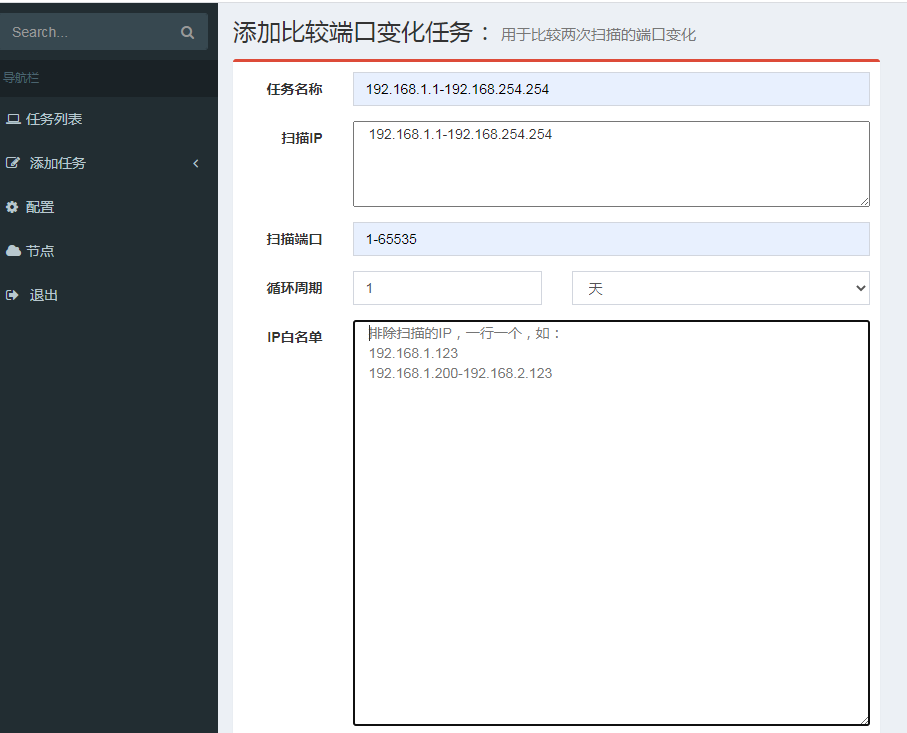
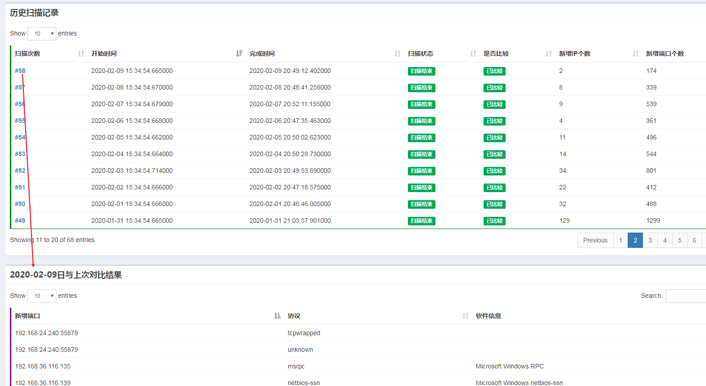

# beholder 

## 介绍

**beholder**是一款简洁而小巧的系统，主要作用是通过监控端口变化来发现企业内部的信息孤岛。例如：运维或开发新部署了一台机器未通知安全。

系统由 `beholder_scanner`、 `beholder_web`  两个部分组成。这两个部分可以部署在一台机器上，也可以分开部署在不同的机器上。**当前项目为 `beholder_web`部分**。

* **beholder_scanner**：对IP进行端口扫描、比较端口变化，可部署多个beholder_scanner来组成集群加快扫描速度。
* **beholder_web**：提供前端界面展示。

## 支持平台

* Linux
* Windows

## 安装指南

 

**依赖：项目运行依赖于mongodb和redis，所以需准备好mongodb和redis。mongodb和redis安装请参考：**

* [mongodb安装](./docs/mongodb.md)
* [redis安装](./docs/redis.md)

*** 
web端和scanner端的整体部署步骤都集中在[scanner的README](https://github.com/zj1244/beholder_scanner#%E5%AE%89%E8%A3%85%E6%8C%87%E5%8D%97)，这里不再重复。

## 使用手册

### 1. 配置
登陆平台后，需要在【配置】中设置扫描并发数。如果需要把比较结果发送邮箱，请配置邮件相关信息。

### 2. 新增扫描任务
在【添加任务】页面中，添加需要监控的IP段和端口。注意：
* 任务名称不能重复
* 如果循环周期选择【不循环】，则添加的是一次性任务
* 如果一个循环周期内扫描没有完成，下个循环周期开始时不会添加任务

### 3. 查看端口变化
**当任务循环扫描两次（不含两次）以上时，才会进行端口比较。**

点击【任务列表】->【扫描详情】

在【扫描详情】页面，点击【扫描次数】，可以查看每次扫描的IP变化。

